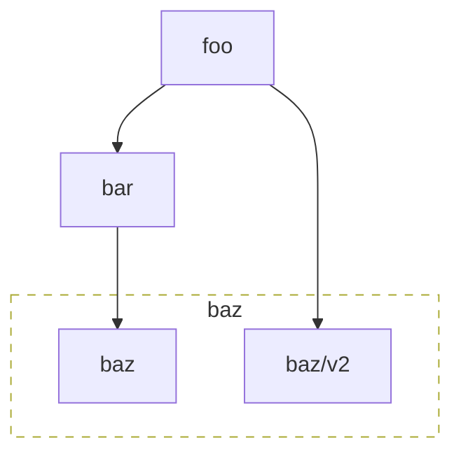

# modgraph

`modgraph` generates a mermaid flowchart from `go mod graph` output.

```shell
$ modgraph --help
Usage of modgraph:
  -prefix string
        prefix to filter
  -v    verbose mode
```

```shell
go mod graph | modgraph -prefix github.com/smartcontractkit/
```

## Example

