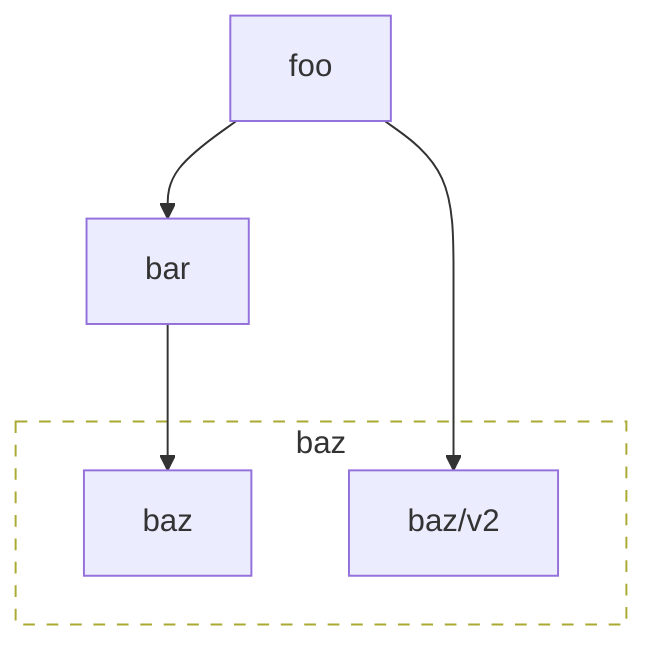

# modgraph

`modgraph` generates a mermaid flowchart from `go mod graph` output.

```shell
$ modgraph --help
Usage of modgraph:
  -v	verbose mode
  -prefix string
   	prefix to filter
  -detect-cycles
   	fail if the module-name graph (versions collapsed) contains cycles
```

```shell
go mod graph | modgraph -prefix github.com/smartcontractkit/
```

```shell
go mod graph | modgraph -prefix github.com/smartcontractkit/ -detect-cycles # fail if there any import cycles between modules
```

## Example


```mermaid
flowchart
	bar --> baz
	click bar href "https://github.com/example/bar"
	baz
	click baz href "https://github.com/example/baz"
	baz/v2
	click baz/v2 href "https://github.com/example/baz"
	foo --> bar
	foo --> baz/v2
	click foo href "https://github.com/example/foo"

	subgraph baz-repo[baz]
		 baz
		 baz/v2
	end
	click baz-repo href "https://github.com/example/baz"

	classDef outline stroke-dasharray:6,fill:none;
	class baz-repo outline
```
